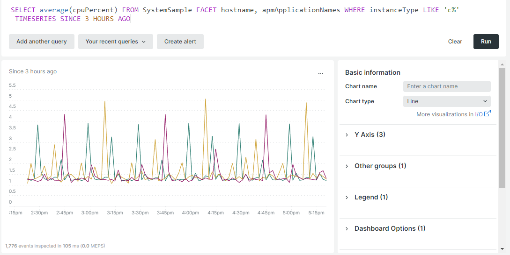

# Dimensionamento automático

O dimensionamento automático adiciona ou remove automaticamente recursos da infraestrutura em nuvem para manter o desempenho ideal e custos razoáveis. Atualmente, este recurso só está disponível para projetos configurados com uma [Arquitetura em escala](scaled-architecture.md).

## Nós do servidor da Web

A [camada da Web](scaled-architecture.md#web-tier) é dimensionada para acomodar um aumento nas solicitações de processo e requisitos de tráfego mais altos. Atualmente, o recurso de dimensionamento automático só é dimensionado horizontalmente adicionando ou removendo nós do servidor da Web.

Um evento de dimensionamento automático ocorre quando o uso e o tráfego do CPU atingem um limite predefinido:

- **Nós adicionados** — as CPUs/núcleos em todos os nós da Web ativos têm 75% de capacidade por 1 minuto e o tráfego está aumentando 20% em 5 minutos consecutivos.
- **Nós removidos** — CPUs/núcleos em todos os nós da Web ativos são carregados a 60% por 20 minutos. Os nós são removidos na ordem em que foram adicionados.

Os limites mínimo e máximo são determinados e definidos com base nos limites de recursos contratados de cada comerciante; isso reduz o risco de escalonamento infinito.

## Monitorar limites com o New Relic

Você pode usar o [serviço New Relic](../monitor/new-relic-service.md) para monitorar determinados limites, como a contagem de hosts e o uso do CPU. As consultas New Relic a seguir usam uma notação variável para `cluster-id` somente para fins de exemplo.

>[!TIP]
>
>Para obter uma referência sobre criação de consultas, consulte [sintaxe, cláusulas e funções do NRQL](https://docs.newrelic.com/docs/query-your-data/nrql-new-relic-query-language/get-started/nrql-syntax-clauses-functions/) na documentação do _New Relic_.
>Use suas consultas para criar um [painel do New Relic](https://docs.newrelic.com/docs/query-your-data/explore-query-data/dashboards/introduction-dashboards/).

### Contagem de hosts

O exemplo de consulta New Relic a seguir mostra a contagem de hosts no ambiente:

```sql
SELECT uniqueCount(SystemSample.entityId) AS 'Infrastructure hosts', uniqueCount(Transaction.host) AS 'APM hosts seen' FROM SystemSample, Transaction where (Transaction.appName = 'cluster-id_stg' AND Transaction.transactionType = 'Web') OR SystemSample.apmApplicationNames LIKE '%|cluster-id_stg|%' TIMESERIES SINCE 3 HOURS AGO
```

Na captura de tela a seguir, **hosts APM vistos** refere-se ao número de hosts com transações registradas durante o período selecionado.


### Uso do CPU

O exemplo de consulta do New Relic a seguir mostra o uso do CPU para nós da Web:

```sql
SELECT average(cpuPercent) FROM SystemSample FACET hostname, apmApplicationNames WHERE instanceType LIKE 'c%' TIMESERIES SINCE 3 HOURS AGO
```



## Ativar dimensionamento automático

Para habilitar ou desabilitar o dimensionamento automático para o projeto de infraestrutura em nuvem do Adobe Commerce, [Envie um tíquete de Suporte da Adobe Commerce](https://experienceleague.adobe.com/docs/commerce-knowledge-base/kb/help-center-guide/magento-help-center-user-guide.html#submit-ticket). Escolha os seguintes motivos no ticket:

- **Motivo do contato**: Solicitação de Alteração de Infraestrutura
- **Motivo do Contato do Adobe Commerce Infrastructure**: Outra Solicitação de Alteração de Infraestrutura

>[!IMPORTANT]
>
>O recurso de dimensionamento automático captura eventos imprevistos. Mesmo que o dimensionamento automático esteja habilitado, a Adobe recomenda que você continue a [Enviar um tíquete de Suporte da Adobe Commerce](https://experienceleague.adobe.com/docs/commerce-knowledge-base/kb/help-center-guide/magento-help-center-user-guide.html#submit-ticket) se esperar um evento futuro.

### Teste de carga

O Adobe habilita o dimensionamento automático no cluster _de preparo_ do projeto de nuvem primeiro. Depois de executar e concluir o teste de carga em seu ambiente, o Adobe habilita o dimensionamento automático em seu cluster de produção. Para obter orientação sobre teste de carga, consulte [Teste de desempenho](../launch/checklist.md#performance-testing).

### INCLUIR NA LISTA DE PERMISSÕES IP

Após ativar o dimensionamento automático, o tráfego do nó da Web de saída é originado dos endereços IP dos nós de serviço. Se você usar uma inclui na lista de permissões com um serviço de terceiros que não esteja incluído no seu projeto do Adobe Commerce incluir na lista de permissões na infraestrutura em nuvem, verifique os endereços IP no arquivo de verificação de serviço de terceiros.

Por exemplo:

- Se a inclui na lista de permissões tiver os endereços IP dos nós de serviço (1, 2 e 3), nenhuma ação será necessária.
- Se a inclui na lista de permissões contém os endereços IP dos nós de serviço (1, 2 e 3) e dos nós da Web (4, 5 e 6) — neste caso, todos os seis nós —, nenhuma ação é necessária.
- Se a incluir na lista de permissões inclui na lista de permissões ➡ contiver os endereços IP _only_ para os nós da Web (4, 5 e 6), será necessário atualizar a pesquisa para incluir os endereços IP dos nós de serviço.
