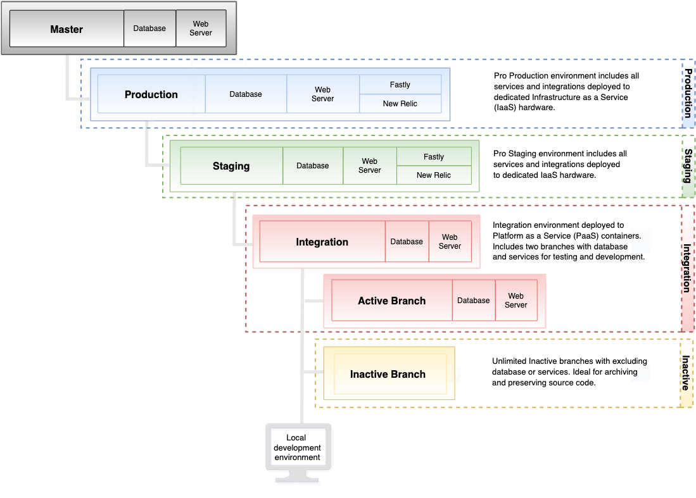

# Arquitetura Pro

Sua arquitetura Pro do Adobe Commerce na infraestrutura em nuvem é compatível com vários ambientes que você pode usar para desenvolver, testar e iniciar sua loja.

- **Mestre** — Fornece uma ramificação `master` implantada nos contêineres PaaS (Platform as a service).
- **Integração** — Fornece uma única ramificação `integration` para desenvolvimento, embora você possa criar uma ramificação adicional. Isso permite até duas ramificações _ativas_ implantadas nos contêineres do Platform as a service (PaaS).
- **Preparo** — Fornece uma única ramificação `staging` implantada em contêineres IaaS (Infraestrutura como um serviço) dedicados.
- **Produção** — Fornece uma única ramificação `production` implantada em contêineres IaaS (Infraestrutura como um serviço) dedicados.

A tabela a seguir resume as diferenças entre ambientes:

|                                        | INTEGRAÇÃO | ESTÁGIOS | PRODUÇÃO |
| -------------------------------------- | ----------- | ----------------- | -------------------- |
| Dá suporte ao gerenciamento de configurações no [!DNL Cloud Console] | Sim | Limitado | Limitado |
| Suporta várias ramificações | Sim | Não (somente armazenamento temporário) | Não (somente produção) |
| Usa arquivos YAML para configuração | Sim | Não | Não |
| É executado em hardware IaaS dedicado | Não | Sim | Sim |
| Inclui o Fastly CDN | Não | Sim | Sim |
| Inclui o serviço New Relic | Não | APM | APM + NRI |
| Backups automáticos | Não | Sim | Sim |

>[!NOTE]
>
>O Adobe fornece a ferramenta Cloud Docker para Commerce para implantação em um ambiente do Cloud Docker local, para que você possa desenvolver e testar projetos do Adobe Commerce. Consulte [Desenvolvimento do Docker](../dev-tools/cloud-docker.md).

## Arquitetura do ambiente

Seu projeto é um único repositório Git com três ramificações de ambiente principais: `integration`, `staging` e `production`. O diagrama a seguir mostra a relação hierárquica dos ambientes Pro:



### Ambiente mestre

Em projetos Pro, a ramificação `master` fornece um ambiente PaaS ativo com seu ambiente de produção. Sempre envie uma cópia do código de produção para o ambiente `master` para que você possa depurar o ambiente de produção sem interromper os serviços.

**Avisos:**

- **não** crie uma ramificação baseada na ramificação `master`. Use o ambiente de integração para criar ramificações ativas para desenvolvimento.

- Não usar o ambiente `master` para desenvolvimento, UAT ou teste de desempenho

### Ambiente de integração

O ambiente de integração é executado em um container Linux (LXC) em uma grade de servidores conhecida como PaaS. Cada ambiente inclui um servidor da Web e um banco de dados para testar o site. Consulte [Endereços IP Regionais](../project/regional-ip-addresses.md) para obter uma lista de endereços IP do AWS e do Azure.

**Casos de uso recomendados:**

Os ambientes de integração são projetados para testes e desenvolvimento limitados antes de mover as alterações para ambientes de preparo e produção. Por exemplo, você pode usar o ambiente de integração para concluir as seguintes tarefas:

- Verifique se as alterações nos processos de integração contínua (CI) são compatíveis com a nuvem

- Teste fluxos de trabalho críticos em páginas principais como Página inicial, Categoria, Página de detalhes do produto (PDP), Check-out e Administração

Para obter o melhor desempenho no ambiente de integração, siga estas práticas recomendadas:

- Restringir o tamanho do catálogo - Para referência, os Dados de amostra contêm cerca de 2.048 produtos. Tente reduzir o tamanho do catálogo para cerca de 4.000 a 5.000 produtos.
Para verificar o número de produtos no catálogo, execute a seguinte consulta MySQL:

  ```sql
  select distinct count(entity_id) from catalog_product_entity;
  ```

- Reduzir o número de grupos de clientes - ter muitos grupos de clientes pode afetar o desempenho da indexação e o desempenho geral.

- Limitar o uso a um ou dois usuários simultâneos

- Desative os trabalhos cron e execute manualmente conforme necessário

**Avisos:**

- Os serviços Fastly CDN e New Relic não estão acessíveis em um ambiente de integração

- A arquitetura do ambiente de integração não corresponde à arquitetura de preparo e produção

- Não usar o ambiente `integration` para teste de desenvolvimento, teste de desempenho ou teste de aceitação de usuário (UAT)

- Não use o ambiente `integration` para testar B2B para funcionalidade do Adobe Commerce

- Não é possível restaurar o banco de dados no ambiente de integração a partir da produção ou preparação do banco de dados

{{enhanced-integration-envs}}

### Ambiente de preparo

O ambiente de preparo fornece um ambiente de quase produção para testar o site. Esse ambiente, que é hospedado em hardware IaaS dedicado, inclui todos os serviços, como Fastly CDN, New Relic APM e pesquisa.

**Casos de uso recomendados:**

O ambiente corresponde à arquitetura de produção e foi projetado para UAT, preparo de conteúdo e revisão final antes de enviar recursos para o ambiente `production`. Por exemplo, você pode usar o ambiente `staging` para concluir as seguintes tarefas:

- Teste de regressão com base nos dados de produção

- Teste de desempenho com o Fastly caching ativado

- Teste novas builds em vez de correção na produção

- Teste UAT para novas builds

- Testar B2B para Adobe Commerce

- Personalizar a configuração do cron e testar os trabalhos do cron

Consulte [Fluxo de trabalho de implantação](pro-develop-deploy-workflow.md#deployment-workflow) e [Implantação de teste](../test/staging-and-production.md).

**Avisos:**

- Depois de iniciar o site de produção, use o ambiente de preparo principalmente para testar patches para correções de erros críticos de produção.

- Você não pode criar uma ramificação a partir da ramificação `staging`. Em vez disso, você envia as alterações de código da ramificação `integration` para a ramificação `staging`.

{{second-staging}}

### Ambiente de produção

O ambiente de produção executa suas vitrines para o público em geral de um único site e de vários sites. Esse ambiente é executado em hardware IaaS dedicado com nós redundantes de alta disponibilidade para acesso contínuo e proteção de failover para seus clientes. O ambiente de produção inclui todos os serviços no ambiente de preparo, além do serviço [New Relic Infrastructure (NRI)](../monitor/new-relic-service.md#new-relic-infrastructure), que se conecta automaticamente aos dados do aplicativo e à análise de desempenho para fornecer monitoramento dinâmico do servidor.

**Aviso:**

Você não pode criar uma ramificação a partir da ramificação `production`. Em vez disso, você envia as alterações de código da ramificação `staging` para a ramificação `production`.

### Pilha de tecnologia de produção

O ambiente de produção tem três máquinas virtuais (VMs) por trás de um Balanceador de Carga Elástico gerenciado por um HAProxy por VM. Cada VM inclui as seguintes tecnologias:

- **Fastly CDN** — Cache HTTP e CDN

- **NGINX**—servidor Web usando PHP-FPM, uma instância com vários workers

- **GlusterFS** — servidor de arquivos para gerenciar todas as implantações de arquivos estáticos e a sincronização com quatro montagens de diretório:

   - `var`
   - `pub/media`
   - `pub/static`
   - `app/etc`

- **Redis** — um servidor por VM com apenas um ativo e os outros dois como réplicas

- **Elasticsearch**—pesquise por Adobe Commerce na infraestrutura de nuvem 2.2 a 2.4.3-p2

- **OpenSearch**—pesquisar Adobe Commerce na infraestrutura de nuvem 2.3.7-p3, 2.4.3-p2, 2.4.4 e posterior

- **Galera** — cluster de banco de dados com um banco de dados MariaDB MySQL por nó com uma configuração de incremento automático de três para IDs exclusivas em cada banco de dados

A figura a seguir mostra as tecnologias usadas no ambiente de produção:


## Hardware redundante

Em vez de executar uma configuração tradicional, ativa-passiva `master` ou uma configuração primária-secundária, o Adobe Commerce na infraestrutura em nuvem executa uma _arquitetura redundante_, em que todas as três instâncias aceitam leituras e gravações. Essa arquitetura oferece tempo de inatividade zero durante o dimensionamento e garante a integridade transacional.

Devido ao hardware único e redundante, o Adobe pode fornecer três servidores gateway. A maioria dos serviços externos do permite adicionar vários endereços IP a um incluo na lista de permissões, portanto, ter mais de um endereço IP fixo não é um problema. Os três gateways são mapeados para os três servidores em seu cluster de ambiente de produção e mantêm endereços IP estáticos. Ele é totalmente redundante e altamente disponível em todos os níveis:

- DNS
- Rede de entrega de conteúdo (CDN)
- Balanceador de carga elástico (ELB)
- Cluster de três servidores que inclui todos os serviços da Adobe Commerce, incluindo o banco de dados e o servidor da Web

## Backup e recuperação de desastres

O Adobe Commerce na infraestrutura em nuvem usa uma arquitetura de alta disponibilidade que replica cada projeto Pro em três zonas de disponibilidade do AWS ou do Azure separadas, cada zona com um data center separado. Além dessa redundância, os ambientes de preparo e produção Pro recebem backups dinâmicos e regulares projetados para uso em casos de _falha catastrófica_.

**Os backups automáticos** incluem dados persistentes de todos os serviços em execução, como o banco de dados MySQL e os arquivos armazenados nos volumes montados. Os backups são salvos no EBS (Elastic Block Storage, armazenamento em bloco elástico) criptografado na mesma região do ambiente de produção. Os backups automáticos não são acessíveis publicamente porque são armazenados em um sistema separado.

>[!NOTE]
>
>Os volumes montados incluem/referem-se apenas a [montagens graváveis](https://experienceleague.adobe.com/pt-br/docs/commerce-on-cloud/user-guide/configure/app/properties/properties#mounts) e não incluirão todo o diretório `app/`. Quanto aos outros arquivos, eles são criados/gerados pelo [processo de compilação e implantação](https://experienceleague.adobe.com/pt-br/docs/commerce-on-cloud/user-guide/architecture/pro-develop-deploy-workflow#deployment-workflow), e você também terá que verificar se há arquivos restantes no repositório Git.

{{pro-backups}}

Você pode criar um **backup manual** do banco de dados para seus ambientes de Preparo e Produção usando comandos da CLI. Consulte [Fazer backup do banco de dados](../storage/database-dump.md). Para ambientes `integration`, a Adobe recomenda criar um backup como uma primeira etapa depois de acessar seu projeto do Adobe Commerce na infraestrutura em nuvem e antes de aplicar qualquer alteração importante. Consulte [Gerenciamento de backup](../storage/snapshots.md).

### Objetivo de ponto de recuperação

Entre em contato com o Gerente de sucesso do cliente do Adobe para obter detalhes sobre o tempo do objetivo do ponto de recuperação até o último backup. A frequência dos backups depende da programação de backup do seu plano e do volume de alterações a serem gravadas no serviço de armazenamento.

### Política de retenção

O Adobe retém backups automáticos de acordo com a seguinte política de retenção de dados:

| Período | Política de Retenção de Backup |
| ------------------ | ----------------------- |
| Dias 1 a 3 | Um backup por hora |
| Dias 4 a 7 | Um backup por dia |
| Semanas 2 a 6 | Um backup por semana |
| Semanas 8 a 12 | Um backup quinzenal |
| Mês 3 até 5 | Um backup por mês |

Essa política pode variar dependendo do seu plano de infraestrutura em nuvem.

### Meta de tempo de recuperação

O RTO depende do tamanho do armazenamento. Grandes volumes de EBS demoram mais tempo para restaurar. Os tempos de restauração podem variar dependendo do tamanho do banco de dados. Entre em contato com o Gerente de sucesso do cliente do Adobe para obter mais detalhes.

## Escalabilidade de cluster Pro

O dimensionamento do cluster Pro e as configurações de _computação_ variam dependendo do provedor de nuvem escolhido (AWS, Azure), da região e das dependências do serviço. A infraestrutura em nuvem de Adobe pode dimensionar clusters Pro para acomodar as expectativas de tráfego e os requisitos de serviço à medida que as demandas mudam.

A arquitetura redundante capacita a infraestrutura em nuvem do Adobe a fazer upscaling sem tempo de inatividade. Ao fazer o upscaling, cada uma das três instâncias gira para atualizar a capacidade sem afetar a operação do site. Por exemplo, você pode adicionar servidores web extras a um cluster existente se a restrição estiver no nível do PHP em vez do nível do banco de dados. Isso fornece _dimensionamento horizontal_ para complementar o dimensionamento vertical fornecido por CPUs extras no nível do banco de dados. Consulte [Arquitetura em escala](scaled-architecture.md).

Se você esperar um aumento significativo no tráfego por um evento ou outro motivo, poderá solicitar um aumento temporário na capacidade. Consulte [Como solicitar um upsize temporário](https://experienceleague.adobe.com/docs/commerce-knowledge-base/kb/how-to/how-to-request-temporary-magento-upsize.html?lang=pt-BR) na _Central de Ajuda do Commerce_.
