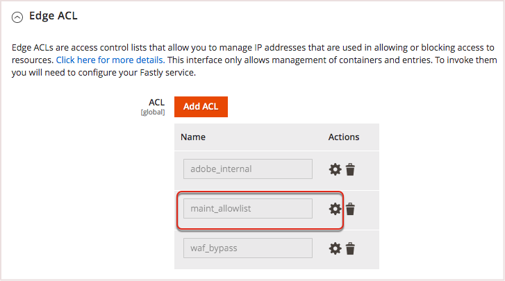

# Personalizar configuração do cache

Depois de configurar e testar o serviço Fastly nos ambientes de Preparo e Produção, revise e personalize as configurações do cache. Por exemplo, você pode atualizar as configurações para permitir que forçar o TLS redirecione solicitações HTTP para o Fastly, atualizar as configurações de limpeza e habilitar a autenticação básica para proteger seu site com senha durante o desenvolvimento.

As seções a seguir fornecem uma visão geral e instruções para definir algumas configurações de cache.

>[!IMPORTANT]
>
>As opções de Administrador disponíveis para configurar o cache do Fastly dependem da versão do Módulo CDN do Fastly para Magento 2 que está instalada. A Adobe recomenda que você [atualize o módulo Fastly](fastly-configuration.md#upgrade) para o módulo Fastly nos ambientes de Preparo e Produção para a versão mais recente. Para obter as informações mais recentes, consulte as [Notas de versão da CDN Fastly para o módulo Magento2](https://github.com/fastly/fastly-magento2/blob/master/Release-Notes.md).

## Forçar TLS

O Fastly fornece a opção _Forçar TLS_ para redirecionar solicitações não criptografadas (HTTP) para o Fastly. Depois que o ambiente de preparo ou produção for provisionado com um [certificado SSL/TLS válido](fastly-configuration.md#provision-ssltls-certificates), você poderá atualizar a configuração do Fastly no armazenamento para habilitar a opção Forçar TLS. Consulte o [Guia de Forçar TLS](https://github.com/fastly/fastly-magento2/blob/master/Documentation/Guides/FORCE-TLS.md) do Fastly na documentação do _Módulo CDN do Fastly para Magento 2_.

>[!NOTE]
>
>A ativação da opção Forçar TLS é uma prática recomendada para o Adobe Commerce em lojas de infraestrutura em nuvem.

## Estender tempo limite do Fastly

A configuração do serviço Fastly especifica um período de tempo limite padrão de 180 segundos para solicitações HTTPS para o Administrador. Qualquer processamento de solicitação que exceda o período de tempo limite retorna um erro 503. Como resultado, você pode receber 503 erros em resposta a solicitações que exigem processamento demorado ou ao tentar executar operações em massa.

Para concluir ações em massa que demoram mais de 3 minutos, altere o _value_ de tempo limite do caminho de administração_ para evitar erros 503.

>[!NOTE]
>
>Se você tiver especificado um ponto de extremidade de Caminho do Administrador personalizado no campo **Caminho do Administrador Personalizado** em **Lojas** > **Configuração** > **Avançado** > **Administrador** > **URL de Base do Administrador**, também precisará definir a [Variável ADMIN_URL](../environment/variables-admin.md#change-the-admin-url) nesse ambiente com o mesmo valor. Se as configurações forem diferentes, o tempo limite não funcionará.
>
>Para estender os parâmetros de tempo limite do Fastly para outra pessoa que não o Administrador na interface do Fastly, consulte [Aumentar Tempo Limite para Trabalhos Longos](https://github.com/fastly/fastly-magento2/blob/master/Documentation/Guides/Edge-Modules/EDGE-MODULE-INCREASE-TIMEOUTS-LONG-JOBS.md).

**Para estender o tempo limite do Fastly para o Administrador**:

{{admin-login-step}}

1. Clique em **Lojas** > Configurações > **Configuração** > **Avançado** > **Sistema** e expanda **Cache de Página Inteira**.

1. Na seção _Configuração Rápida_, expanda **Configuração Avançada**.

1. Defina o valor de **Tempo limite do caminho do administrador** em segundos. Esse valor não pode ser superior a 10 minutos (600 segundos).

>[!NOTE]
>
>A definição de configuração **_Tempo limite do caminho de administrador_** não controla valores de tempo limite fora do Adobe Commerce, como o tempo limite do Fastly WAF. Para ajustar o valor de tempo limite do Fastly WAF, abra um tíquete de Suporte da Adobe para atualizá-lo no serviço Fastly.

1. Clique em **Salvar configuração** na parte superior da página.

1. Depois que a página for recarregada, selecione **Carregar VCL para Fastly** na seção _Configuração do Fastly_.

O Fastly recupera o caminho do Administrador para gerar o arquivo VCL do arquivo de configuração `app/etc/env.php`.

## Configurar opções de limpeza

O Fastly fornece vários tipos de opções de limpeza na página Gerenciamento de Cache do Magento, incluindo opções para limpar categoria de produto, ativos de produto e conteúdo. Quando ativado, o Fastly observa eventos para limpar automaticamente esses caches. Se você desativar uma opção de expurgação, poderá expurgar manualmente os caches do Fastly após finalizar as atualizações através da página Gerenciamento de Cache.

As opções de limpeza incluem:

- **Limpar categoria**-Limpa o conteúdo da categoria do produto (não o conteúdo do produto) quando você adiciona e atualiza um único produto. Talvez você queira manter essa opção desativada e ativar a opção Limpar produto, que limpa produtos e categorias de produtos.
- **Limpar produto**-Limpa todo o conteúdo do produto e da categoria do produto ao salvar uma única modificação em um produto. Ativar a opção Limpar produto pode ser útil para obter atualizações imediatamente para os clientes ao alterar um preço, adicionar uma opção de produto e quando o inventário de produto estiver esgotado.
- **Limpar página do CMS**-Limpa o conteúdo da página ao atualizar e adicionar páginas ao Adobe Commerce CMS. Por exemplo, talvez você queira expurgar ao atualizar os Termos e condições ou a política de Devolução. Se você raramente fizer essas alterações, poderá desativar a limpeza automática.
- **Limpeza suave**-Define o conteúdo alterado para obsoleto e limpa de acordo com o tempo obsoleto. Além dos tempos obsoletos, os clientes recebem conteúdo obsoleto, enquanto o Fastly atualiza o conteúdo em segundo plano.

**Para configurar as opções de limpeza do Fastly**:

1. Na seção _Configuração Rápida_, expanda **Configuração Avançada** para exibir as opções de limpeza.

1. Para cada opção de limpeza, selecione **Sim** para habilitar a limpeza automática ou **Não** para desabilitar a limpeza automática.

   Ao desabilitar uma opção de limpeza, você deve limpar manualmente o cache dessa categoria da página _Gerenciamento de Cache_.

1. Clique em **Salvar configuração** na parte superior da página.

1. Depois que a página for recarregada, selecione **Carregar VCL para Fastly** na seção _Configuração do Fastly_.

Para obter mais informações, consulte [as opções de configuração do Fastly](https://github.com/fastly/fastly-magento2/blob/21b61c8189971275589219d418332798efc7db41/Documentation/CONFIGURATION.md#further-configuration-options).

## Configurar manipulação de GeoIP

O módulo Fastly inclui o manuseio de GeoIP para redirecionar os visitantes automaticamente ou fornecer uma lista de lojas que correspondem ao código de país obtido. Se você já usa uma extensão para manipulação de GeoIP, talvez precise verificar os recursos com as opções do Fastly.

**Para configurar a manipulação de GeoIp**:

{{admin-login-step}}

1. Clique em **Lojas** > Configurações > **Configuração** > **Avançado** > **Sistema** e expanda **Cache de Página Inteira**.

1. Na seção _Configuração Rápida_, expanda **Configuração Avançada**.

1. Role para baixo e selecione **Sim** para **Habilitar GeoIP**. Opções adicionais de configuração são exibidas.

1. Para a Ação GeoIP, selecione se o visitante for redirecionado automaticamente com **Redirect** ou se tiver fornecido uma lista de armazenamentos para seleção com **Dialog**.

1. Para **Mapeamento do País**, selecione **Adicionar** para inserir um código de país de duas letras para mapear com um armazenamento Adobe Commerce específico de uma lista.

   

1. Clique em **Salvar configuração** na parte superior da página.

1. Após o recarregamento da página, selecione **Carregar VCL para Fastly** na seção _Configuração do Fastly_.

>[!NOTE]
>
>A implementação atual do módulo Adobe Commerce Fastly GeoIP não oferece suporte a redirecionamentos entre vários sites.

O Fastly também fornece uma série de [recursos de VCL relacionados à geolocalização](https://developer.fastly.com/reference/vcl/variables/geolocation/) para codificação de geolocalização personalizada.

## Ativar módulos do Fastly Edge

Os Módulos do Fastly Edge são uma estrutura flexível que permite a definição de componentes da interface do usuário e do código VCL associado por meio de um modelo. Esses módulos facilitam a personalização e a extensão da configuração do serviço Fastly por meio da interface do usuário, em vez de usar trechos de VCL personalizados.

Os módulos do Edge permitem habilitar funcionalidades específicas, como cabeçalhos CORS, substituições de mapas do site da nuvem e configurar a integração entre a loja do Adobe Commerce e outros CMSs ou back-ends.

Para acessar o menu Módulos do Edge para exibir, configurar e gerenciar os módulos disponíveis, ative a opção _Habilitar módulos do Fastly Edge_. Consulte [Fastly Edge Modules](https://github.com/fastly/fastly-magento2/blob/master/Documentation/Guides/Edge-Modules/EDGE-MODULES.md) na documentação do Fastly CDN module.

## Configurar back-ends e blindagem de origem

As configurações de back-end fornecem ajuste fino para o desempenho do Fastly com a blindagem Origin e tempos limite. Um _back-end_ é um local específico (IP ou domínio) com as configurações de proteção de origem e tempo limite definidas para verificação e fornecimento de conteúdo em cache.

_A blindagem de origem_ roteia todas as solicitações do armazenamento para um Ponto de Presença (POP) específico. Quando uma solicitação é recebida, o POP verifica o conteúdo em cache e o fornece. Se não for armazenado em cache, ele continuará para o POP do Shield e, em seguida, para o servidor de Origem, que armazena o conteúdo em cache. Os escudos reduzem o tráfego diretamente para a origem.

O código padrão do Fastly VCL especifica valores padrão para a blindagem de Origem e tempos limite para seu Adobe Commerce em sites de infraestrutura em nuvem. Em alguns casos, pode ser necessário modificar os valores padrão. Por exemplo, se você estiver recebendo erros de Tempo até o Primeiro Byte (TTFB), talvez precise ajustar o valor de _tempo limite do primeiro byte_.

>[!NOTE]
>
>Se o seu site requer recursos funcionais fornecidos através de uma integração de back-end como o [Wordpress](fastly-vcl-wordpress.md), personalize a configuração do serviço Fastly para adicionar o back-end e gerenciar os redirecionamentos do armazenamento do Adobe Commerce para o Wordpress. Para obter detalhes, consulte [Módulos do Fastly Edge - Outra integração do CMS/Backend](https://github.com/fastly/fastly-magento2/blob/master/Documentation/Guides/Edge-Modules/EDGE-MODULE-OTHER-CMS-INTEGRATION.md) na documentação do módulo Fastly.

**Para examinar a configuração de definições de back-end**:

{{admin-login-step}}

1. Clique em **Lojas** > Configurações > **Configuração** > **Avançado** > **Sistema** e expanda **Cache de Página Inteira**.

1. Expanda a seção **Configuração rápida**.

1. Expanda **Configurações de backend** e selecione a engrenagem para verificar o back end padrão. Uma modal é aberta mostrando as configurações atuais com opções para alterá-las.

   

1. Selecione o local (ou data center) do **Shield**.

   A configuração padrão do Fastly para o seu projeto define o local mais próximo à região do Cloud Service. Se precisar alterá-lo, selecione um local próximo ao local padrão.

1. Modifique os valores de tempo limite (em microssegundos) para a conexão com a blindagem, tempo entre bytes e tempo para o primeiro byte. Recomendamos manter as configurações padrão de tempo limite.

1. Opcionalmente, selecione **Ativar o back-end e a Proteção após editar ou salvar**.

1. Clique em **Carregar** para salvar suas alterações e carregá-las nos servidores do Fastly.

1. Em Admin, selecione **Salvar configuração**.

Para obter mais informações, consulte o [Guia de configurações de backend](https://github.com/fastly/fastly-magento2/blob/21b61c8189971275589219d418332798efc7db41/Documentation/Guides/BACKEND-SETTINGS.md) na documentação do módulo Fastly.

## Autenticação básica

A autenticação básica é um recurso para proteger todas as páginas e ativos do site com um nome de usuário e uma senha.

O Adobe **não recomenda** a ativação da autenticação básica no ambiente de Produção. Você pode configurá-lo no ambiente de preparo para proteger seu site durante o processo de desenvolvimento. Consulte o [Guia de Autenticação Básica](https://github.com/fastly/fastly-magento2/blob/master/Documentation/Guides/BASIC-AUTH.md) na documentação do módulo CDN Fastly.

Se você adicionar acesso de usuário e habilitar a autenticação básica no ambiente de preparo, ainda será possível acessar o Administrador sem exigir credenciais adicionais.

>[!NOTE]
>
>**não** verifique [!UICONTROL Enable HTTP access control] no Console da Nuvem se há algum ambiente em que o Fastly esteja habilitado (como ambientes de Preparo ou de Produção não dinâmicos). Se o controle de acesso for configurado dessa maneira, os usuários que antes tinham acesso podem continuar a acessar o site se suas credenciais permanecerem armazenadas em cache pelo Fastly, mesmo após o acesso ter sido rescindido.

## Criar trechos de VCL personalizados

O Fastly oferece suporte a uma versão personalizada do Varnish Configuration Language (VCL) para personalizar a configuração do serviço Fastly. Por exemplo, você pode permitir, bloquear ou redirecionar o acesso de usuários específicos ou endereços IP usando blocos de código VCL com dicionários de borda e de Lista de controle de acesso (ACL).

Para obter instruções sobre como criar trechos de VCL personalizados, dicionários de borda e ACLs, consulte [Trechos de VCL Fastly personalizados](fastly-vcl-custom-snippets.md).

>[!NOTE]
>
>Antes de adicionar código VCL personalizado, dicionários de borda e ACLs à configuração do módulo Fastly, verifique se o serviço de cache do Fastly funciona com a configuração padrão. Consulte [Configurar Fastly](fastly-configuration.md).

## Gerenciar domínios

Para projetos Starter e Pro, você pode usar a opção [!UICONTROL Domains] para adicionar e gerenciar a configuração de domínio do Fastly para sua loja.

- Para projetos Iniciais, vá para a URL do Projeto na guia [!UICONTROL Domains] em [!DNL Cloud Console] para adicionar a URL do Projeto.

- Para projetos Pro, envie um [tíquete de Suporte da Adobe Commerce](https://experienceleague.adobe.com/docs/commerce-knowledge-base/kb/help-center-guide/magento-help-center-user-guide.html?lang=pt-BR#submit-ticket) para adicionar o domínio à configuração do seu projeto na nuvem. A equipe de suporte também atualiza a configuração da conta do Adobe Commerce Fastly para adicionar o domínio.

**Para gerenciar a configuração do domínio Fastly com o Administrador**:

{{admin-login-step}}

1. Selecione **Lojas** > Configurações > **Configuração** > **Avançado** > **Sistema** e expanda **Cache de Página Inteira**.

1. Na seção Admin _Fastly Configuration_, selecione **Domains**.

1. Clique em **Gerenciar Domínios** para abrir a página Domínios.

1. Adicione os nomes de nível superior e subdomínio para as lojas no ambiente de nuvem.

   Você só pode especificar domínios que já foram adicionados à sua configuração de infraestrutura na nuvem.

   

1. Clique em **Ativar** para atualizar a configuração do domínio Fastly.

>[!NOTE]
>
>Se o mesmo domínio tiver sido configurado em uma conta diferente do Fastly, você deverá enviar um tíquete de suporte do Adobe Commerce para solicitar a Delegação de Domínio antes de adicionar o domínio ao Adobe Commerce. Consulte [Várias contas do Fastly e domínios atribuídos](fastly.md#multiple-fastly-accounts-and-assigned-domains).

## Ativar modo de manutenção

Use a opção _Modo de Manutenção_ para permitir acesso administrativo ao site a partir de endereços IP especificados, retornando uma página de erro para todas as outras solicitações.

**Para habilitar o modo de Manutenção com acesso Administrativo**:

1. Abra a seção _Configuração do Fastly_ no Administrador.

1. Na seção _Edge ACL_, atualize a ACL (lista de controle de acesso) do `maint_allow` com os endereços IP administrativos que podem acessar seu repositório enquanto ele está no modo de Manutenção.

   

1. Na seção _Modo de Manutenção_, selecione **Habilitar Modo de Manutenção**.

   Após habilitar o modo de manutenção, todo o tráfego será bloqueado, exceto as solicitações dos endereços IP na ACL `maint_allowlist`. Você pode atualizar o `maint_allowlist` para alterar os endereços IP na ACL.

   Para obter instruções detalhadas de configuração, consulte o [guia do Modo de manutenção](https://github.com/fastly/fastly-magento2/blob/master/Documentation/Guides/MAINTENANCE-MODE.md) na documentação do Fastly CDN para o módulo Magento 2.
