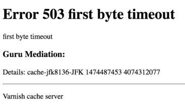
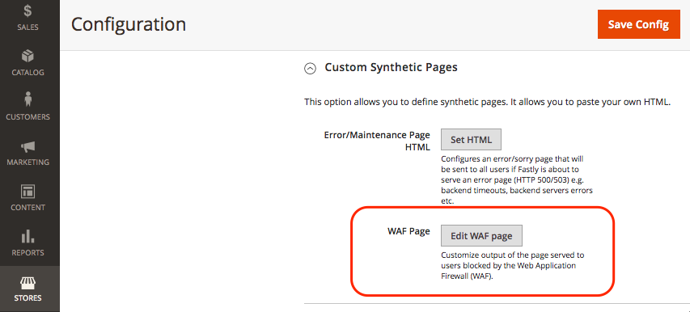

# Personalizar páginas de erro e manutenção

Quando uma solicitação para a origem do Fastly falha, o Fastly retorna páginas de resposta padrão com formatação básica e mensagens genéricas que podem ser confusas para os usuários. Por exemplo, o Fastly retorna a seguinte página de erro padrão quando uma solicitação para a origem do Fastly falha devido a um erro 503.



Você pode atualizar a configuração da loja do Adobe Commerce para substituir algumas páginas de resposta padrão por páginas com mensagens mais amigáveis e estilo de HTML aprimorado, como mostrado no exemplo a seguir.


Atualmente, você pode personalizar as seguintes páginas de resposta do Fastly para seu projeto do Adobe Commerce na infraestrutura da nuvem.

- [Erros do servidor - Erro interno do servidor, tempo limite ou paralisações de manutenção do site (código de erro 500 ou superior)](#customize-the-503-error-page)
- [O WAF bloqueia eventos que ocorrem quando o WAF detecta tráfego de solicitação suspeito (403 Proibido)](#customize-the-waf-error-page)

**requisitos de codificação de HTML:**

O código de HTML da página personalizada deve atender aos seguintes requisitos:

- O conteúdo pode conter até 65.535 caracteres.
- Especifique todos os CSS em linha na origem do HTML.
- Agrupe imagens na página de HTML usando base64 para que elas sejam exibidas mesmo se o Fastly estiver offline. Consulte [URIs de dados no site de dicas em css](https://css-tricks.com/data-uris/).

## Personalizar a página de erro 503

Os clientes veem a página de erro 503 padrão nos seguintes casos:

- Quando uma solicitação para a origem Fastly retorna um status de resposta maior que 500
- Quando a origem do Fastly está inativa, como tempo limite, atividade de manutenção ou problemas de integridade

Você pode personalizar a página padrão adaptando o seguinte código de HTML para incluir o estilo para corresponder ao tema da loja do Adobe Commerce e modificando o título e as mensagens conforme necessário.

```html
<!DOCTYPE html>
<html>
   <head>
      <meta charset="UTF-8">
         <title>503</title>
   </head>
   <body>
      <p>Service unavailable</p>
   </body></html>
```

Verifique se a origem modificada é exibida corretamente no navegador. Em seguida, adicione o código de HTML personalizado à configuração do Fastly.

Para adicionar a página de resposta personalizada à configuração do Fastly:

{{admin-login-step}}

1. Selecione **Lojas** > **Configurações** > **Configuração** > **Avançadas** > **Sistema**.

1. No painel direito, expanda **Cache de Página Inteira** > **Configuração Rápida** > **Páginas Sintéticas Personalizadas**.

   

1. Selecione **Definir HTML**.

1. Copie e cole o código-fonte da sua página de resposta personalizada no campo HTML.

   

1. Selecione **Fazer upload** na parte superior da página para fazer upload da origem de HTML personalizada para o servidor Fastly.

1. Selecione **Salvar configuração** na parte superior da página para salvar o arquivo de configuração atualizado.

1. Atualize o cache.

   - Na notificação na parte superior da página, selecione o link *Gerenciamento de Cache*.

   - Na página Gerenciamento de cache, selecione **Liberar cache de Magento**.

## Personalizar a página de erro do WAF

Os clientes veem a seguinte página de erro padrão do WAF quando uma solicitação para a origem do Fastly falha com um erro `403 Forbidden` causado por um evento de bloqueio do [WAF](fastly-waf-service.md).


O código de amostra a seguir mostra a fonte do HTML para a página padrão:

```html
<html>
  <head>
    <title>Magento 403 Forbidden</title>
  </head>
  <body>
    <p>The requested URL was rejected.</p>
    <p>For additional information, please contact support and provide this reference ID:</p>
    <p>"} req.http.x-request-id {"</p>
    <p><button onclick='history.back();'>Go Back</button></p>
  </body>
</html>
```

Você pode usar a opção **Páginas Sintéticas Personalizadas** > **Editar página do WAF** no menu de configuração do Fastly para personalizar o código padrão do seu projeto do Adobe Commerce na infraestrutura em nuvem. Ao editar o código, mantenha a seguinte linha que fornece a ID de referência para o evento de bloqueio do WAF:

```html
<p>"} req.http.x-request-id {"</p>
```

>[!NOTE]
>
>A opção Editar WAF só estará disponível se o serviço Managed Cloud WAF estiver habilitado para o projeto Adobe Commerce na infraestrutura em nuvem.

**Para editar a página de erro do WAF**:

1. [Faça logon no Administrador](../../get-started/onboarding.md#access-your-admin-panel).

1. Selecione **Lojas** > **Configurações** > **Configuração** > **Avançadas** > **Sistema**.

1. No painel direito, expanda **Cache de Página Inteira** > **Configuração Rápida** > **Páginas Sintéticas Personalizadas**.

   

1. Selecione **Editar página do WAF**.

1. Preencha os campos para atualizar o HTML.

   

   - **Status** — Selecione o status `403 Forbidden`.
   - **Tipo MIME** — Tipo `text/html`.
   - **Conteúdo** — Edite a resposta de HTML padrão para adicionar CSS personalizado e atualize o título e as mensagens conforme necessário.

1. Selecione **Fazer upload** na parte superior da página para fazer upload da origem de HTML personalizada para o servidor Fastly.

1. Selecione **Salvar configuração** na parte superior da página para salvar o arquivo de configuração atualizado.

1. Atualize o cache.

   - Na notificação na parte superior da página, selecione o link **Gerenciamento de Cache**.

   - Na página Gerenciamento de cache, selecione **Liberar cache de Magento**.

## Exibir número do relatório de erros

Por padrão, o Fastly oculta todos os erros do Adobe Commerce atrás do erro *503 Serviço Indisponível*. Para exibir o número do relatório de log de erros para que você possa encontrar e revisar os detalhes dos erros nos logs, abra o site omitindo o Fastly usando estas etapas:

1. Recupere o endereço IP do armazenamento:

   - Para ambientes de preparo e produção profissionais:

     ```bash
     nslookup {your_project_id}.ent.magento.cloud
     ```

   - Para ambientes de integração Pro e ambientes iniciais:

     ```bash
     nslookup gw.{your_region}.magentosite.cloud
     ```

1. Adicione o domínio do aplicativo e o endereço IP ao arquivo de hosts na estação de trabalho local:

   ```text
   {server_IP} {store_domain}
   ```

1. Limpe o cache do navegador e os cookies (ou alterne para o modo incógnito).

1. Abra o site da loja novamente para exibir o código de erro.

1. Use o código de erro para localizar os detalhes no arquivo de relatório de erros:

   - [Conectar ao ambiente afetado usando SSH](../development/secure-connections.md#connect-to-a-remote-environment)

   - Localize o arquivo `./var/report/{error_number}`.
