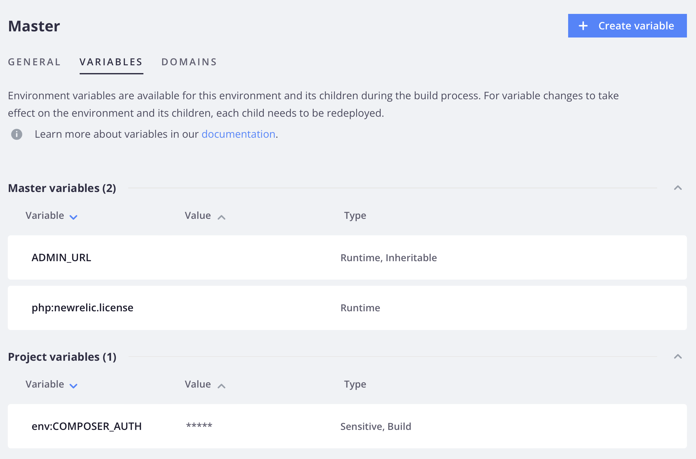

# Níveis variáveis

As variáveis de projeto se aplicam a todos os ambientes no projeto. As variáveis de ambiente se aplicam a um ambiente ou ramificação específica. Um ambiente _herda_ definições de variável do ambiente pai.

É possível substituir um valor herdado definindo a variável especificamente para o ambiente. Por exemplo, para definir variáveis para desenvolvimento, defina os valores das variáveis no arquivo `.magento.env.yaml` no ambiente de integração. Todos os ambientes que se ramificam do ambiente de integração herdam esses valores. Consulte [Configuração de implantação](configure-env-yaml.md) para obter detalhes sobre como configurar seu ambiente usando o arquivo `.magento.env.yaml`.

>[!BEGINTABS]

>[!TAB CLI]

**Para definir variáveis usando a CLI da Nuvem**:

- **Variáveis específicas de projeto**—Para definir o mesmo valor para _todos_ ambientes em seu projeto. Essas variáveis estão disponíveis na build e no tempo de execução em todos os ambientes.

  ```bash
  magento-cloud variable:create --level project --name <variable-name> --value <variable-value>
  ```

- **Variáveis específicas do ambiente**—Para definir um valor único para um ambiente _específico_. Essas variáveis estão disponíveis no tempo de execução e são herdadas por ambientes secundários. Especifique o ambiente no comando usando a opção `-e`.

  ```bash
  magento-cloud variable:create --level environment --name <variable-name> --value <variable-value>
  ```

Depois de definir variáveis específicas do projeto, você deve reimplantar manualmente o ambiente remoto para que a alteração entre em vigor. Encaminhe as novas confirmações para acionar uma reimplantação.

>[!TAB Console]

**Para definir variáveis usando[!DNL Cloud Console]**:

1. No _[!DNL Cloud Console]_, clique no ícone de configuração no lado direito da navegação do projeto.

   {width="36"}

1. Para definir uma variável de nível de projeto, em _Configurações do Projeto_, clique em **Variáveis**.

   

1. Para definir uma variável de nível de ambiente, na lista _Ambientes_, selecione um ambiente e clique na guia **[!UICONTROL Variables]**.

   

1. Clique em **[!UICONTROL Create variable]**.

1. Forneça um nome e valor para a variável. Escolha entre as opções:

   - Disponível durante o tempo de execução
   - Disponível durante o tempo de compilação
   - Valor JSON
   - Variável sensível (valor oculto no console e respostas da CLI)
   - Tornar herdável (ambientes secundários podem herdar variáveis de nível de ambiente)

1. Clique em **[!UICONTROL Create variable]**.

>[!CAUTION]
>
>Definir variáveis específicas do ambiente no [!DNL Cloud Console] reimplanta automaticamente o ambiente.

>[!ENDTABS]

## Visibilidade

É possível limitar a visibilidade de uma variável durante a compilação ou o tempo de execução usando o comando `--visible-<build|runtime>`. Além disso, há opções para definir a herança e a sensibilidade.

Use as seguintes opções para impedir que uma variável seja vista ou herdada:

- `--inheritable false` — desabilita a herança de ambientes filhos. Isso é útil para definir valores somente de produção na ramificação `master` e permitir que todos os outros ambientes usem uma variável de nível de projeto com o mesmo nome.
- `--sensitive true` — marca a variável como _não legível_ em [!DNL Cloud Console]. Não é possível exibir a variável na interface do usuário; no entanto, é possível exibi-la no container do aplicativo, como qualquer outra variável.

A seguir, é mostrado um caso específico para impedir que uma variável seja vista ou herdada. Você só pode especificar essas opções na CLI. Esse caso não se refere a todas as variáveis de ambiente disponíveis.

```bash
magento-cloud variable:create --name <variable-name> --value <variable-value> --inheritable false --sensitive true
```

## Verificar níveis e valores de variável

Você pode exibir uma lista de variáveis existentes usando a CLI da nuvem.

```bash
magento-cloud variables
```

```
Variables on the project Project-Name (<project-id>), environment <environment-name>:
+----------------------------+-------------+-------------------------------------------+
| Name                       | Level       | Value                                     |
+----------------------------+-------------+-------------------------------------------+
| env:COMPOSER_AUTH          | project     | {                                         |
|                            |             |    "http-basic": {                        |
|                            |             |       "repo.magento.com": {               |
|                            |             |       "username":                         |
|                            |             | "<public-key>",                           |
|                            |             |       "password":                         |
|                            |             | "<private-key>"                           |
|                            |             |     }                                     |
|                            |             |   }                                       |
|                            |             | }                                         |
| ADMIN_EMAIL                | project     | admin@123.com                             |
| ADMIN_EMAIL                | environment | admin@123.com                             |
| ADMIN_PASSWORD             | environment | password                                  |
| ADMIN_URL                  | environment | admin123                                  |
| ADMIN_USERNAME             | environment | admin                                     |
| php:newrelic.license       | environment | xxxx71fb030366182117f955a22e4baf8exxxxxx  |
+----------------------------+-------------+-------------------------------------------+
```
