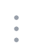
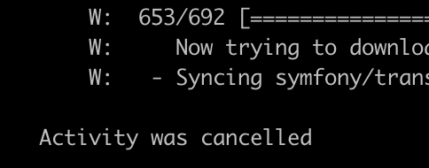
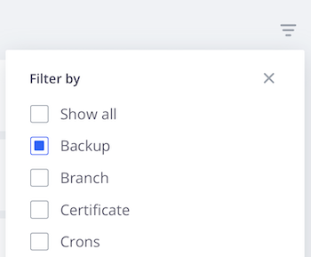

# Fluxo de atividade

A exibição principal de cada ambiente exibe uma lista de eventos históricos de **Atividade** semelhantes a um log do Git. A lista de Atividades é um fluxo dos eventos recentes para ambientes ativos. Veja a seguir uma lista dos tipos de atividades e seus ícones exibidos no fluxo de Atividades:

{width="500" align="center"}

## Exibir logs

Na lista Atividade, clique no ícone de status de uma atividade para exibir o log. Como alternativa, clique no menu {width="32"} (_mais_) para acessar mais opções para gerenciar a atividade. A seguir, é mostrado um log curto que cria um backup. Você pode [usar a CLI da Nuvem](#activity-stream-with-cloud-cli) para exibir o mesmo log.


## Gerenciar uma atividade

Algumas atividades estão com o status _em execução_ ou _pendente_. Você pode agir em uma atividade em execução, como cancelar uma implantação em execução. As guias a seguir mostram dois métodos de cancelamento de uma atividade: o [!DNL Cloud Console] ou a CLI da nuvem.

>[!BEGINTABS]

>[!TAB Console]

**Para cancelar uma atividade no[!DNL Cloud Console]**:

Você pode agir em uma atividade em execução acessando o menu {width="32"} (_mais_) e selecionando uma ação, como `Cancel` ou `View log`. Para este exemplo, selecione a opção **Cancelar** para interromper a atividade em execução.

Nem todas as atividades têm a opção de cancelamento. Por exemplo, a opção para cancelar a implantação do aplicativo aparece somente durante a fase _build_. Depois que o aplicativo for movido para a fase _de implantação_, não será mais possível cancelar a atividade. Consulte [Processo de implantação](../deploy/process.md) sobre as diferentes fases.

{width="450" align="center"}

Se você tiver um terminal executando a atividade de implantação, cancelar no [!DNL Cloud Console] resultará no cancelamento no terminal:

{width="300"}

>[!TAB CLI]

**Para cancelar uma atividade na CLI da Nuvem**:

1. Identifique as atividades em execução e selecione uma ID de atividade.

   ```bash
   magento-cloud activity:list --state=in_progress
   ```

1. Cancele a atividade usando a ID da atividade:

   ```bash
   magento-cloud activity:cancel wvl5wm7s5vkhy
   ```

>[!ENDTABS]

## Filtrar fluxo de atividade

A capacidade de filtrar a lista de atividades é útil quando você está procurando algo específico, como um backup ou um evento de mesclagem.

**Para filtrar a lista de atividades no[!DNL Cloud Console]**:

1. Selecione um ambiente e escolha o modo de exibição Atividade **[!UICONTROL All]** para incluir o histórico completo de eventos.

1. Clique em {width="32"} e selecione as opções **[!UICONTROL Filter by]**:

   

1. Escolha a exibição da Atividade **[!UICONTROL Recent]** e redefina a lista.

## Exibir fluxo com a CLI da nuvem

A CLI do `magento-cloud` fornece a maioria das mesmas capacidades que a [!DNL Cloud Console]. O comando `activity` pode:

- `list` o fluxo de atividades para um ambiente
- `get` detalhes sobre uma atividade específica
- exibir o `log` para uma atividade específica
- `cancel` uma atividade

**Para exibir o fluxo de atividades com a CLI de Nuvem**:

1. Listar as atividades do ambiente atual.

   ```bash
   magento-cloud activity:list
   ```

1. Cada atividade tem uma ID exclusiva. Selecione uma ID na lista anterior e visualize os detalhes dessa atividade.

   ```bash
   magento-cloud activity:get wvl5wm7s5vkhy
   ```

1. Exibir o log completo dessa atividade.

   ```bash
   magento-cloud activity:log wvl5wm7s5vkhy
   ```

   Exemplo de resposta:

   ```bash
   Activity ID: wvl5wm7s5vkhy
   Type: environment.backup
   Description: User created a backup of Master
   Created: 2023-09-08T14:03:33+00:00
   State: complete
   Log:
   Creating backup of master
   Created backup eg5pu63egt2dcojkljalzjdopa
   ```
