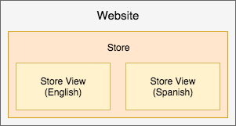

# Práticas recomendadas para configuração de loja

Para obter informações detalhadas sobre como configurar sua loja, sites e sites, consulte o [Guia do Usuário do Adobe Commerce](https://experienceleague.adobe.com/docs/commerce-admin/user-guides/home.html). Esta página fornece práticas recomendadas, informações úteis e diretrizes para configurar suas lojas, sites e muito mais com conteúdo adicional a ser publicado ao longo do tempo e entre versões.

## Campanhas e promoções de marketing

Essas informações são úteis para o Adobe Commerce na infraestrutura em nuvem 2.1.X e 2.2.X.

Para criar campanhas e promoções, crie as opções e configurações em [Preparo de conteúdo](https://experienceleague.adobe.com/docs/commerce-admin/content-design/staging/content-staging.html). Esse recurso permite criar e pré-visualizar suas campanhas antes de torná-las públicas para vendas ao cliente. As informações a seguir fornecem informações úteis. Para obter instruções exatas, consulte o conteúdo vinculado do Guia do usuário do Adobe Commerce.

_Campanhas_ são eventos de marketing para vendas sazonais, novas linhas de produtos e muito mais. Cada campanha pode incluir temas personalizados, blocos de conteúdo, widgets para controlar e exibir conteúdo e promoções associadas a regras de preço. Devido à natureza abrangente de uma campanha, você as cria com uma data de início e término para o armazenamento temporário de conteúdo.

_As promoções_ oferecem descontos, ofertas únicas, cupons, incentivos para compradores pela primeira vez e muito mais. Você cria essas promoções como _Regras de Preço_ que definem os termos, descontos e opções para incentivar os clientes a comprar. Você pode criar regras de preço no [carrinho de compras](https://experienceleague.adobe.com/docs/commerce-admin/marketing/promotions/cart-rules/price-rules-cart.html) ou [catálogo](https://experienceleague.adobe.com/docs/commerce-admin/marketing/promotions/catalog-rules/price-rules-catalog.html), com opções adicionais para banners, pontos de premiação e muito mais. Você pode programar campanhas para suas promoções, aplicando regras de preço para eventos importantes, como uma nova linha de produtos ou vendas sazonais.

Veja a seguir dicas para ajudar a criar, atualizar e gerenciar promoções e campanhas:

* Uma promoção pode fazer parte de uma campanha. Uma campanha não pode fazer parte de uma promoção. Você pode ter listas de promoções como regras de preço para usar várias vezes, com várias campanhas.
* Ao criar uma promoção, ela sempre cria uma campanha inicial que está inativa. Ela tem uma data de início, mas não uma data de término. Você pode ignorar essa campanha inicial. Você pode Programar uma nova atualização com a programação de campanha correta e torná-la ativa.
* Uma campanha tem uma data de início e término, não uma promoção. O Scheduler que aparece quando você cria uma promoção não configura as datas inicial e final para a promoção. Ela permite programar uma campanha para essa promoção enquanto você estiver na página de configuração da promoção.
* Não é possível editar diretamente no Conteúdo dividido. Se você precisar editar as configurações e opções na campanha, edite o original ou uma réplica e envie para substituição no Conteúdo dividido em etapas. Por exemplo, se você não definir uma data de término para uma campanha, deverá editar o original e enviá-lo para atualizar.

## Advanced Pricing e conteúdo transferido

Essas informações são úteis para o Adobe Commerce na infraestrutura em nuvem 2.1.X e 2.2.X.

Normalmente, você pode definir o [Advanced Pricing](https://experienceleague.adobe.com/docs/commerce-admin/catalog/products/pricing/pricing-advanced.html) para produtos por meio da área **Produtos** > **Catálogos** do Administrador. Com o conteúdo dividido, conclua algumas etapas adicionais para adicionar os preços a uma promoção e campanha.

Para editar o Advanced Pricing e atualizar a Preparação de Conteúdo:

1. Faça logon no Administrador.
1. Navegue até **Produtos** > **Catálogo** e selecione um produto e edite-o.
1. Na guia Preços, selecione **Preços avançados**. Edite o preço e Salve as alterações.
1. Na parte superior da página, clique em **Agendar nova atualização**.
1. Crie uma promoção para o produto.
1. Preencha as informações da promoção. Para o Scheduler, informe uma data e hora inicial e final.
1. Salve a promoção. Uma campanha inicial inativa é criada.
1. É possível Visualizar para revisar o preço especial, o nome da promoção, o preço normal e o intervalo de datas programado para a campanha.

Para obter etapas adicionais, continue com as instruções em [Agendar Alterações para Regras de Preço de Catálogo](https://experienceleague.adobe.com/docs/commerce-admin/marketing/promotions/catalog-rules/price-rule-catalog-scheduled-changes.html). Clique em **Avançar** para percorrer as etapas.

## Regras de preço

As regras de preço podem incluir lógica e condições tão ilimitadas quanto sua imaginação de marketing. Alguns exemplos populares incluem Buy One Get One Free, Buy One Get One 50% Off, $25 dólares fora em pedidos acima de $100 dólares e muito mais.

Para criar uma Regra de Preço, consulte [Guia do Usuário do Adobe Commerce](https://experienceleague.adobe.com/docs/commerce-admin/marketing/promotions/catalog-rules/price-rules-catalog-create.html).

A seguir, há um exemplo de criação de uma Regra de Preço para um desconto Somente na Primeira Ordem. Para esse desconto, você gostaria de:

* Crie uma regra de preço com um [segmento de cliente](https://experienceleague.adobe.com/en/docs/commerce-admin/customers/segments/customer-segment-price-rule) com uma condição: Número Total de Pedidos menor que 1
* Adicionar este segmento de cliente como uma condição à regra do carrinho
* Opcional - Adicione condições e regras para aplicar os descontos a SKUs ou categorias de produtos específicos para compras direcionadas

Isso garante que os clientes novos ou existentes que não fizeram uma compra recebam o desconto somente em seu primeiro pedido. Você poderia criar banners e enviar promoções por email para o desconto de compra pela primeira vez.

## Visualizações da loja

Você pode configurar e executar várias lojas com uma única implementação do Adobe Commerce na infraestrutura em nuvem. Consulte [Configurar vários sites ou lojas](multiple-sites.md).

Para lojas que não interagem entre si, você pode criar vários _sites_. Cada site tem artigos específicos, dados do cliente, check-out e carrinho de compras que não são compartilhados com outros sites no Adobe Commerce.

Cada site pode incluir uma ou mais _lojas_ com categorias e artigos diferentes, dados compartilhados do cliente, check-out e carrinho de compras. Para essas lojas, um cliente pode se inscrever uma vez e comprar em diferentes catálogos de produtos com um único check-out.

Além disso, você pode criar _exibições de loja_ para diferentes idiomas, layouts e designs. Cada exibição pode ter um domínio, marca e idioma separados enquanto compartilha artigos, dados do cliente, check-out e carrinho de compras.

Veja a seguir exemplos para explicar melhor:

* Site único com uma loja e duas visualizações para o idioma inglês e espanhol. Todos os dados do artigo, clientes, check-out e carrinho de compras são compartilhados.

  

* Um único site com uma loja para roupas femininas inclui duas visualizações: uma para inglês e outra para espanhol. A loja de roupas infantis inclui uma única vista da loja em inglês. Todos os dados do artigo, clientes, check-out e carrinho de compras são compartilhados. As lojas podem ter domínios e temas diferentes.

  

* Dois sites, um para roupas e outro para decoração de interiores com catálogos e artigos separados diferentes, dados de clientes e carrinho de compras. Cada site pode ter várias lojas e visualizações compartilhando artigos, dados do cliente, check-out e carrinho de compras somente nesse site.

  

>[!WARNING]
>
>Os dados do catálogo se expandem à medida que você aumenta o número de sites e lojas. Dependendo da arquitetura do projeto, os armazenamentos adicionais podem levar a um processo de indexação mais longo e tempos de resposta mais lentos para páginas de catálogo não armazenadas em cache. A Adobe recomenda que você monitore o desempenho do site com cuidado.
