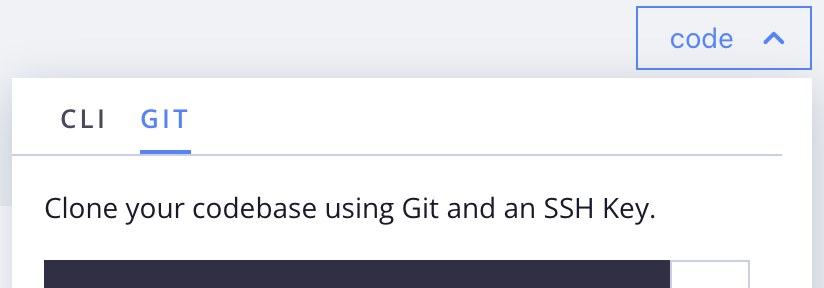

# Preparação para o desenvolvimento

Se você é novo no Commerce ou se é um proprietário existente do Commerce que está migrando para a infraestrutura em nuvem, use essas etapas para preparar um espaço de trabalho de desenvolvimento para seu projeto na nuvem. Se você já concluiu algumas dessas etapas ou tem um ambiente de desenvolvedor do Adobe Commerce existente, analise os resultados esperados a seguir e continue para a próxima etapa. Algumas configurações e fluxos de trabalho diferem de uma instalação local típica.

## Credenciais

Antes de configurar um espaço de trabalho, colete as seguintes chaves e acesso à conta:

- **Chaves de autenticação (Chaves do compositor)**

  As chaves de autenticação são tokens de autenticação de 32 caracteres que fornecem acesso seguro ao repositório do Adobe Commerce Composer (`repo.magento.com`) e a quaisquer outros serviços Git necessários para o desenvolvimento de aplicativos, como o GitHub. Sua conta pode ter várias chaves de autenticação. Para a configuração do espaço de trabalho, comece com uma chave específica para o repositório de códigos. Se você não tiver chaves, contate o proprietário do projeto ou crie você mesmo as [chaves de autenticação](../cloud-guide/development/authentication-keys.md).

- **Conta do Projeto na Nuvem**

  O Proprietário do projeto deve convidá-lo para o projeto Adobe Commerce na infraestrutura em nuvem. Ao receber o convite por email, clique no link e siga as instruções para criar sua conta. Consulte [Integração](onboarding.md).

- **Chave de Criptografia do Adobe Commerce**

  Ao importar somente um sistema existente, capture a chave de criptografia usada para proteger seu acesso e seus dados para o banco de dados. Para obter detalhes sobre esta chave, consulte [Resolver problemas com a chave de criptografia](https://experienceleague.adobe.com/docs/commerce-knowledge-base/kb/troubleshooting/miscellaneous/resolve-issues-with-encryption-key.html?lang=pt-BR)

## Ferramentas do desenvolvedor

- **Instalar a CLI da nuvem**

  Instale a CLI do `magento-cloud` para gerenciar ambientes na Nuvem e executar tarefas de automação. Consulte a [CLI da Nuvem](../cloud-guide/dev-tools/cloud-cli-overview.md) para obter instruções de instalação.

- **Instalar o Docker para desenvolvimento e teste locais**

  Como opção, use o ambiente do Docker para emular o ambiente do Commerce na infraestrutura de nuvem `integration` para desenvolvimento local. Há três componentes essenciais: um modelo Adobe Commerce v2, Docker Compose e um pacote `ece-tools`.

   - [Arquitetura do Docker e comandos comuns](../cloud-guide/dev-tools/cloud-docker.md)
   - [Ambiente de desenvolvimento do Launch Docker](https://developer.adobe.com/commerce/cloud-tools/docker/setup/)
   - [Pacote ECE-Tools](../cloud-guide/dev-tools/package-overview.md)

- **Integrar serviços baseados em Git**

  Opcionalmente, integre um serviço de hospedagem baseado em Git, como GitHub ou GitLab, com o Adobe Commerce na infraestrutura em nuvem. Consulte [Integrações](../cloud-guide/integrations/overview.md).

## Código do projeto

Uma conexão segura é essencial para interagir com os ambientes remotos. Para um novo projeto, [faça logon no [!DNL Cloud Console]](https://console.adobecommerce.com) e clique em **[!UICONTROL No SSH key]**. Esse ícone fica à direita do campo de comando e é visível quando o projeto não contém uma chave SSH. Consulte [Conexões seguras](../cloud-guide/development/secure-connections.md#add-an-ssh-public-key-to-your-account).

**Para clonar sua base de código para sua estação de trabalho local**:

1. No [[!DNL Cloud Console]](https://console.adobecommerce.com), clique em **[!UICONTROL code]** e selecione a guia **[!UICONTROL Git]**.

   {width="450"}

1. Copie o comando `git clone ...` fornecido.

1. Em um terminal, crie e altere para o diretório de trabalho.

1. Cole e execute o comando `git clone ...`.

>[!TIP]
>
>O Adobe provisiona o ambiente inicial do projeto usando um repositório de modelo que inclui instruções de pacote para uma versão específica do Adobe Commerce. Revise o tópico [estrutura de arquivo do projeto](../cloud-guide/project/file-structure.md) e saiba mais sobre arquivos de projeto importantes e modelos na nuvem.
